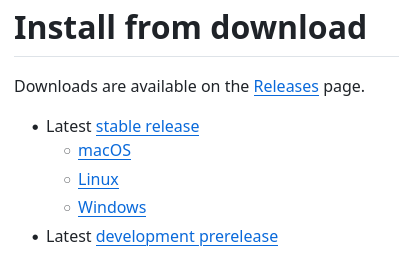

<h1> How to Configure the Neovim Code Editor </h1>

Neovim is acknowledged globally by software developers as a tool that enhances their productivity. However, many coders believe that this increase in productivity comes with a cost. Neovim is often thought of as an unnecessarily complicated alternative to other popular code editors. This perception stems from the fact that Neovim requires significantly more configuration, at least initially, compared to other code editors that may come with many features preinstalled. However, once the process of configuring Neovim is understood, programmers can enjoy numerous long-term benefits. These include having a deeply personalized code editor, gaining a deeper understanding of the editor which facilitates greater intuition when debugging problems, and most importantly, the increased productivity that these aspects provide. This guide will simplify the process of configuring Neovim in order to make this valuable tool as accessible as the leading code editors.

<h3> Prerequisites: </h3>

This guide is for coders who have some experience writing code in some Integrated Development Environment (IDE). Further, this guide assumes that the user is comfortable with the command line, either on a Linux distribution, on Mac OS, or on a unix-like command interface on Windows. 

<h3> Steps: </h3>

1. Install Neovim according to the specifications of the Operating System.
2. Install Git.
3. Install a plugin manager via Github.
4. Install plugins via Github.
5. Configure plugins with the Lua scripting language.

<h2> Step #1: Install Neovim </h2>

[This link](https://github.com/neovim/neovim/blob/master/INSTALL.md "Downloads for Neovim") contains downloads for Linux, Mac, and Windows. Install the latest stable release rather than the development build. The relevant links on the site are shown below.

Neovim can also be installed via the system package manager. For example, on Ubuntu run:

<code> sudo apt install neovim </code>

After following the standard download process for your operating system, the Neovim installation can be verified via the command line by simply running the command: <code> neovim </code> Many users add an alias in their shell configuration or modify the system path so that the editor can be opened by simply typing: <code> vim </code>. Neither of these will be covered here.

The output should be something similar to the screen on the left. This is Neovim’s default splash page which can be changed later. In order to exit Neovim, type <code> :q </code>. If the system says that the command was not found, try installing via another method. For example, if you previously tried installing using a download link, instead try using a package manager or vice versa. In order to learn the basics of Neovim, use <code>:help nvim</code>. Basic usage will not be covered in this tutorial.

<h2> Step #2: Install Git </h2>

Git is a tool which is necessary for both the installation and operation of the plugin manager.

Linux: Use the system package manager. For example on Ubuntu: <code> sudo apt install git-all </code>

Mac: run <code> git </code> from the terminal and an installation window will automatically appear.

Windows: Click [this link](https://git-scm.com/download/win "Windows installer for Git") to download the installer for Git.

<h2> Step #3: Install A Plugin Manager </h2>

In order to properly configure Neovim, it is recommended to install a plugin manager. There are several available options but the current most popular and modern plugin manager is found at this link: https://github.com/folke/lazy.nvim. 

To begin, first navigate to the default configuration file location for your operating system. On Linux, this will be located at ~/.config/nvim. Next, create a file called init.lua and add the following text:

