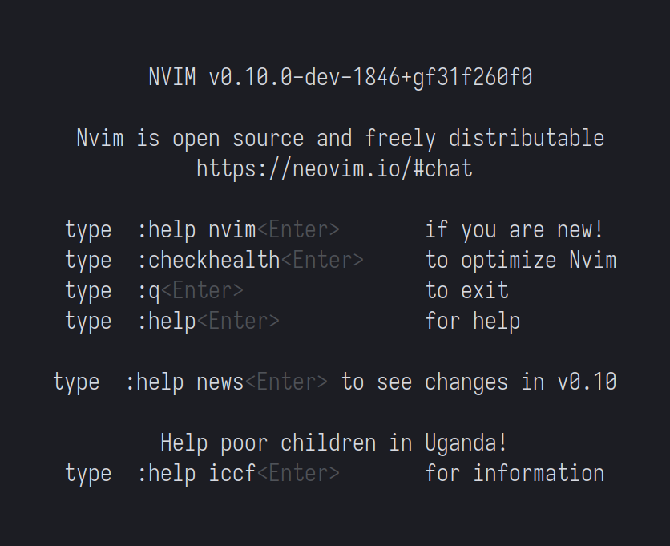
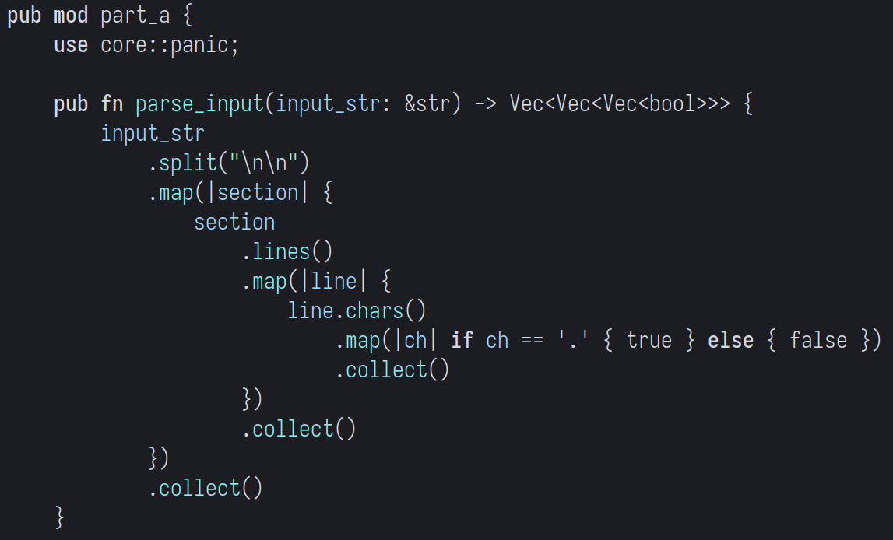
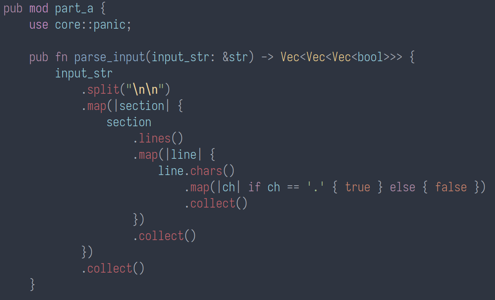
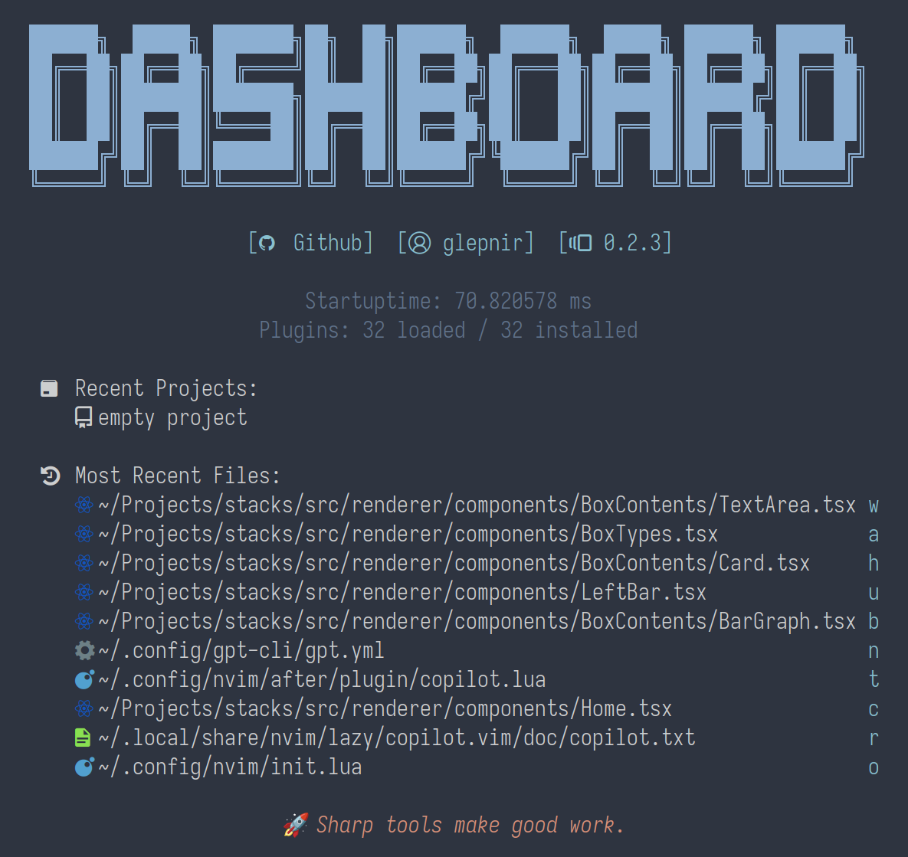

<h1> How to Configure the Neovim Code Editor </h1>

Neovim is acknowledged globally by software developers as a tool that enhances their productivity. However, many coders believe that this increase in productivity comes with a cost. Neovim is often thought of as an unnecessarily complicated alternative to other popular code editors. This perception stems from the fact that Neovim requires significantly more configuration, at least initially, compared to other code editors that may come with many features preinstalled. However, once the process of configuring Neovim is understood, programmers can enjoy numerous long-term benefits. These include having a deeply personalized code editor, gaining a deeper understanding of the editor which facilitates greater intuition when debugging problems, and most importantly, the increased productivity that these aspects provide. This guide will simplify the process of configuring Neovim in order to make this valuable tool as accessible as the leading code editors.

<h3> Prerequisites: </h3>

This guide is for coders who have some experience writing code in some Integrated Development Environment (IDE). Further, this guide assumes that the user is comfortable with the command line, either on a Linux distribution, on Mac OS, or on a unix-like command interface on Windows. 

<h3> Steps: </h3>


<a href="#step1" style="padding-left: 20px;">1. Install Neovim according to the specifications of the Operating System.</a>
<br>
<a href="#step2" style="padding-left: 20px;">2. Install Git.</a>
<br>
<a href="#step3" style="padding-left: 20px;">3. Install a plugin manager via Github.</a>
<br>
<a href="#step4" style="padding-left: 20px;">4. Install plugins via Github.</a>
<br>
<a href="#step5" style="padding-left: 20px;">5. Configure plugins with the Lua scripting language.</a>


<h2 id="step1"> Step #1: Install Neovim </h2>

[This link](https://github.com/neovim/neovim/blob/master/INSTALL.md "Downloads for Neovim") contains downloads for Linux, Mac, and Windows. Install the latest stable release rather than the development build. The relevant links on the site are shown below.

<div align="center">
  
  <p><i>Neovim installation options</i></p>
</div>

Neovim can also be installed via the system package manager. For example, on Ubuntu run:

<code> sudo apt install neovim </code>

After following the standard download process for your operating system, the Neovim installation can be verified via the command line by simply running the command: <code> neovim </code> Many users add an alias in their shell configuration or modify the system path so that the editor can be opened by simply typing: <code> vim </code>. Neither of these will be covered here.

<div align="center">
  
  <p><i>The expected Neovim start screen</i></p>
</div>

The output should be something similar to the screen shown above. This is Neovim’s default splash page which can be changed later.

If the system says that the command was not found, try installing via another method. For example, if you previously tried installing using a download link, instead try using a package manager or vice versa.

<h2 id="step2"> Step #2: Install Git </h2>

Git is a tool which is necessary for both the installation and operation of the plugin manager.

Linux: Use the system package manager. For example on Ubuntu: <code> sudo apt install git-all </code>

Mac: run <code> git </code> from the terminal and an installation window will automatically appear.

Windows: Click [this link](https://git-scm.com/download/win "Windows installer for Git") to download the installer for Git.

<h2 id="step3"> Step #3: Install A Plugin Manager </h2>

In order to properly configure Neovim, it is recommended to install a plugin manager. There are several available options but the current most popular and modern plugin manager is found at this link: https://github.com/folke/lazy.nvim. 

To begin, first navigate to the default configuration file location for your operating system. On Linux, this will be located at ~/.config/nvim. Next, create a file called init.lua and add the following text:

```lua
local lazypath = vim.fn.stdpath("data") .. "/lazy/lazy.nvim"
if not vim.loop.fs_stat(lazypath) then
  vim.fn.system({
    "git",
    "clone",
    "--filter=blob:none",
    "https://github.com/folke/lazy.nvim.git",
    "--branch=stable", -- latest stable release
    lazypath,
  })
end
vim.opt.rtp:prepend(lazypath) 

vim.g.mapleader = " "

require("lazy").setup()
```

In order to verify this step, run vim again and there should be a UI which appears indicating that the Lazy plugin manager is being installed. If there has been no change, there are more detailed instructions on the github page: https://github.com/folke/lazy.nvim. 

<h2 id="step4"> Step #4: Install Plugins </h2>

First, find some plugins which you would like to install. One of the best methods for finding plugins is the following list: [Awesome Neovim Plugins](https://github.com/rockerBOO/awesome-neovim)

Once, you have found the plugin, the process for installing it is simple. For example, if you wanted to install the following plugin: https://github.com/EdenEast/nightfox.nvim which modifies the colorsscheme of the editor, you would place the text following *github.com* within the call to setup the lazy plugin manager like so:

```lua
require("lazy").setup({
  "EdenEast/nightfox.nvim"
})
```

The plugin will be installed by Lazy automatically after you restart Neovim. The before and after pictures are shown below.

<div align="center">
  
  <p><i>Neovim before applying the Nord colorscheme</i></p>
</div>

<div align="center">
  
  <p><i>Neovim after applying the Nord colorscheme</i></p>
</div>

As you can see, the text is now much more readable and pleasant to look at. 

In order to install more plugins, simply add them in list format to the setup function like so:

```lua
require("lazy").setup({
  "EdenEast/nightfox.nvim", "nvim-treesitter/nvim-treesitter", "windwp/nvim-autopairs", "folke/trouble.nvim",
})
```

> Plugins often have dependencies and requirements so installing a plugin may not be as simple as the process shown above. If the process is different, it should be explained on the Github page of that particular plugin.

<h2 id="step5"> Step #5: Configure Plugins with the Lua Scripting Language </h2>

One of the main strengths of Neovim as compared to the original Vim is the usage of the Lua scripting language, which makes the process of configuring Neovim and Neovim plugins straightforward and consistent. Instead of forcing each individual plugin maker to specify unique ways to configure their plugins, all plugins are configured in essentially the same manner using Lua. 

For illustration, the setup for [dashboard-nvim](https://github.com/nvimdev/dashboard-nvim) will be demonstrated. This custom startup screen displays recent files, recent projects, and more.

The first step in configuring a plugin is visiting the plugin's github page in order to see what configuration options are available. From [dashboard-nvim](https://github.com/nvimdev/dashboard-nvim)'s github page, we can see that the suggested configuration method for this plugin is to modify the setup function of the lazy plugin manager. The plugin's page includes the following code:

```lua
{  'nvimdev/dashboard-nvim',
  event = 'VimEnter',
  config = function()
    require('dashboard').setup {
      -- config
    }
  end,
  dependencies = { {'nvim-tree/nvim-web-devicons'}}
}
```

This indicates that instead of simply adding <code>'nvimdev/dashboard-nvim'</code> to the lazy plugin setup function, we will add the whole content including the brackets. Building off of the configuration above, this would look like the following.

```lua
require("lazy").setup({
  "EdenEast/nightfox.nvim", "nvim-treesitter/nvim-treesitter", "windwp/nvim-autopairs", "folke/trouble.nvim",
  {  'nvimdev/dashboard-nvim',
    event = 'VimEnter',
    config = function()
      require('dashboard').setup {
        -- config
      }
    end,
    dependencies = { {'nvim-tree/nvim-web-devicons'}}
  }
})
```

Now, in order to actually configure this plugin, modify the line: <code> -- config </code> to include the actual configuration. There are many options shown on [dashboard-nvim](https://github.com/nvimdev/dashboard-nvim)'s github page but to keep it simple we will just set the theme. The available themes are doom and hyper. I will use hyper, replacing <code> -- config </code> with <code>theme = 'hyper'</code> like so:

```lua
      require('dashboard').setup {
        theme = 'hyper'
      }
```

Finally, restart Neovim and the lazy plugin manager will automatically install the plugin. The result is that now when Neovim is opened the default splashpage (which is shown above) has been replaced with the following screen, a large improvement. 

<div align="center">
  
  <p><i>The new Neovim splashpage after installing dashboard-nvim</i></p>
</div>

<h3> Troubleshooting Tips </h3>

If Neovim or a plugin is displaying an unexpected bug, installing the development version of Neovim may solve the problem. Plugin developers often build plugins based off of the most recent development version rather than the stable release. Further, the last stable version which is included in system package managers may not be the most recent stable version. For these reasons, installing the development version from the link in step 1 may solve unexpected problems.

